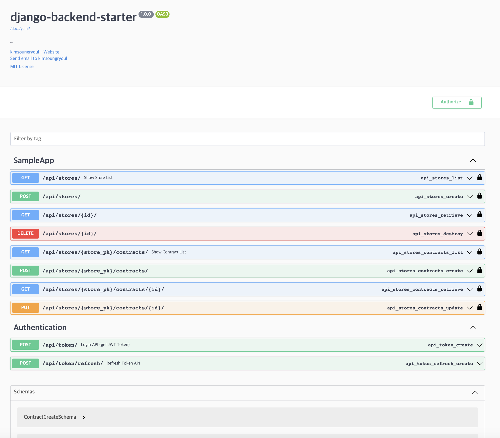
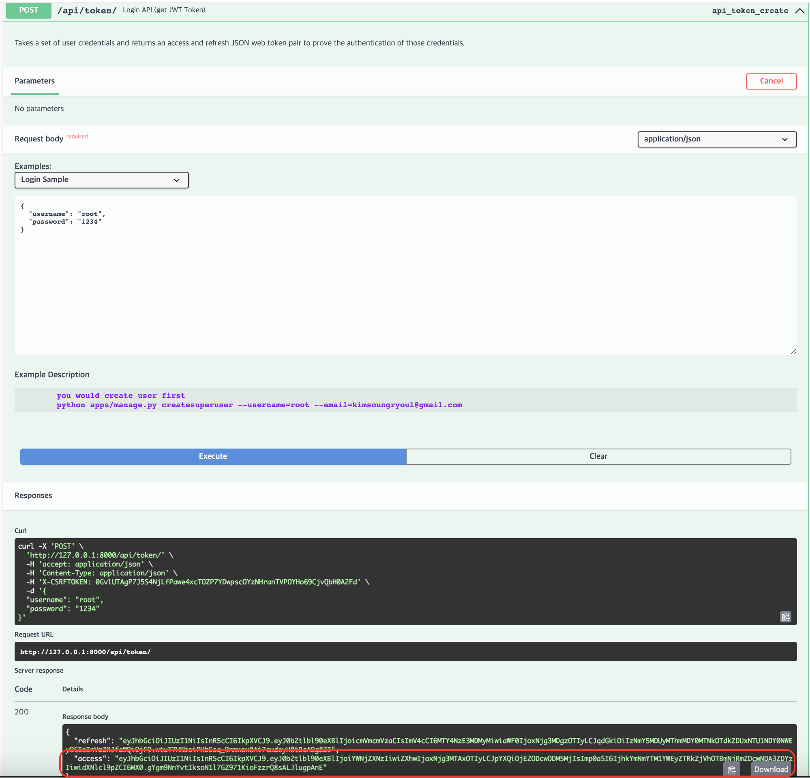
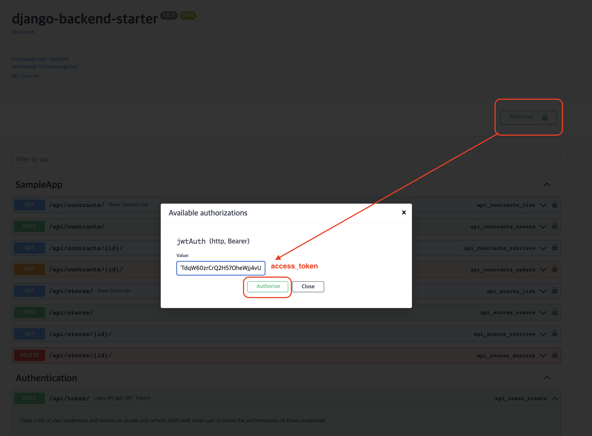
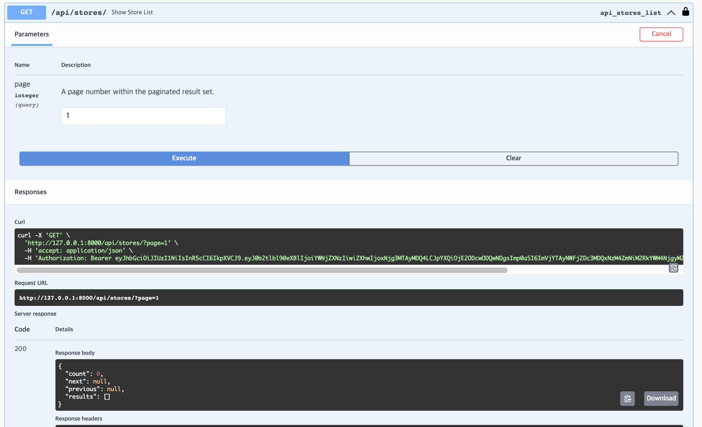

# [django-backend-starter Template]

## [django-backend-starter template docs](#)

## QuickStart

1. create django-project
   ~~~shell
   pip install django
   ~~~   

   ~~~shell
   django-admin startproject --template=https://github.com/KimSoungRyoul/django-backend-starter-template/archive/main.zip  hello_django_project
   ~~~

2. create virtualenv(venv) using poetry & install library
    ~~~shell
    poetry config virtualenvs.in-project true # if true .venv was created in PROJECT ROOT
    poetry shell
    poetry install
    ~~~

3. [Optional] install pre-commit config
   * if you want always run black&isort before commit
   ~~~shell
   pre-commit install
   ~~~
   * pre-commit run (reformatting)
   ~~~shell
   pre-commit run --files apps/**/**
   ~~~

4. [Optional] if you want to use not only sqlite3
   ~~~shell
   docker compose -f docker/compose.yaml up -d
   ~~~

5. django migration
    ~~~shell
    python apps/manage.py migrate
    ~~~

6. create superuser for test
   ~~~shell
   python apps/manage.py createsuperuser --username=root --email=kimsoungryoul@gmail.com
   ~~~

7. django runserver
    ~~~shell
    python apps/manage.py runserver 8000
    ~~~

8. you can see default API Docs in http://localhost:8000/docs

   

   8-1. get JWT Token with Login API

   

   8-2. set JWT Token to API Docs

   

   8-3. you can use other APIs

   

## build
* install docker first [install docker desktop](https://www.google.com/search?q=docker+desktop&sourceid=chrome&ie=UTF-8)
1. docker build
   ~~~shell
   docker build -f docker/application.dockerfile -t django-backend-starter-application:1.0.0 .
   ~~~
2. docker run
   ~~~shell
   docker run -d -p "8000:8000" --rm --name django-backend-application django-backend-starter-application:1.0.0
   ~~~
